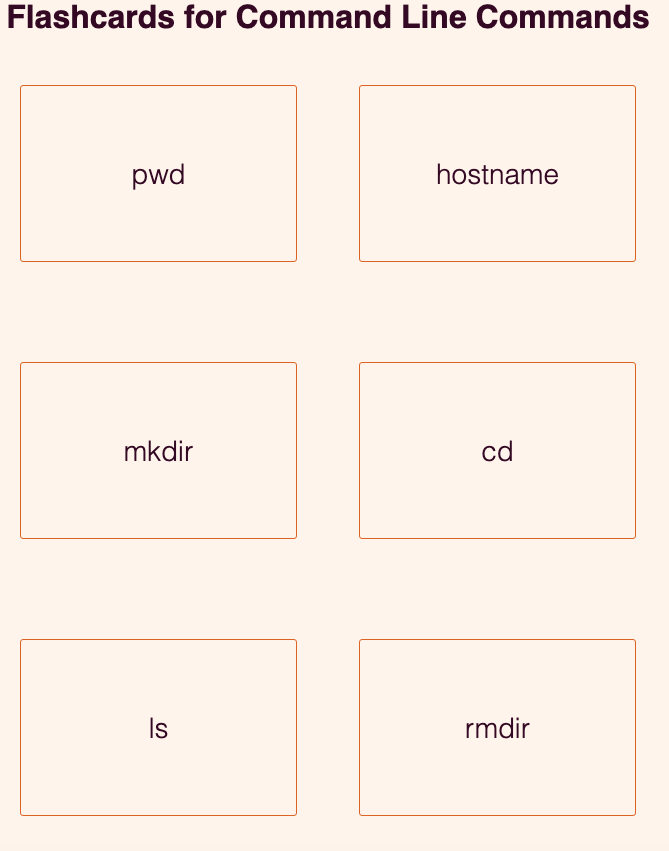

#  Flashcards
Flashcard to learn command line built with React
Projects from [Learn JavaScript](https://scrimba.com/learn/learnjavascript) course from [Scrimba](https://scrimba.com)

## Live Site
[Command Line Flashcards](https://command-line-flash-cards.netlify.app/)

## Table of Contents
[Introduction](#Introduction)

[Motivation](#Motivation)

[Built With](#built-with)

[License](#License)

[Acknowledgements](#Acknowledgements)

## Introduction
Welcome to Command Line Flashcards. As I was working my way through Command Line Crash Course, one part was to memorize command line prompts. I used react to quickly create simple web application to memorize command line prompts

## Motivation
I began the Command Line Crash Course to learn command line. I started out with physical flashcards to memorize command line prompts. When they started to wear out I decided to create a flashcard web application. 

## Built With
- React
- CSS

## License
[MIT](https://choosealicense.com/licenses/mit/)

## Acknowledgements
Thanks to [The Command Line Crash Course](https://cglab.ca/~morin/teaching/1405/clcc/book/cli-crash-course.html) for putting together this curriculum.  